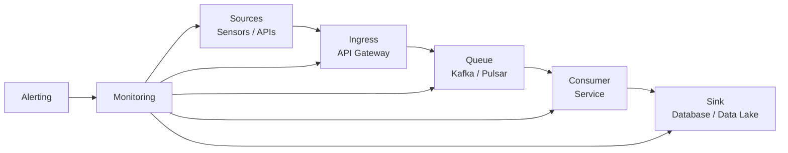
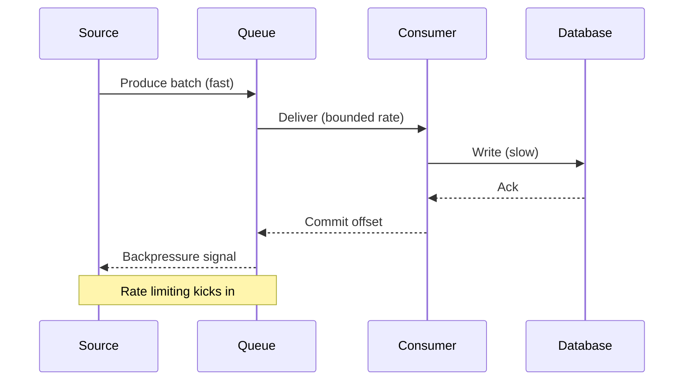
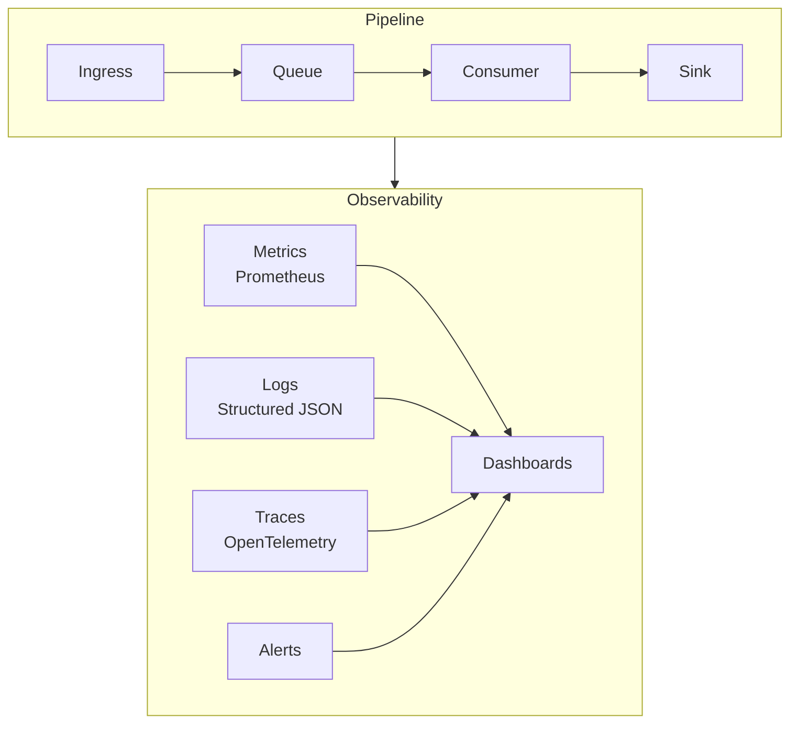
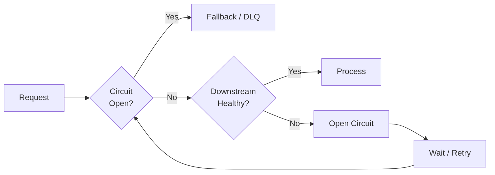

Real-time ingestion looks simple in a diagram: a source, a queue, a consumer, a database. In production it becomes a negotiation between throughput, correctness, and the messy reality of upstream systems that go down at the worst possible time.

## Backpressure is a feature, not a failure

When downstream slows, you have three options: drop, buffer, or block. Pretending it never happens is not one of them. Designing an explicit backpressure strategy — bounded queues, consumer lag alerts, and graceful degradation — is what keeps a pipeline from silently falling behind.

```python
async def consume(stream, sink, max_inflight=256):
    semaphore = asyncio.Semaphore(max_inflight)
    async for batch in stream:
        async with semaphore:
            await sink.write(batch)  # bounded concurrency = natural backpressure
```

## Idempotency saves your on-call rotation

At-least-once delivery means duplicates are not a maybe, they are a when. Every write path should be idempotent — an upsert keyed on a stable identifier, not a blind insert. This single decision turns a class of 3 a.m. incidents into a non-event.

## Make data-quality problems loud

The worst pipeline failure is the silent one: data keeps flowing, but it is subtly wrong. Dashboards look fine until someone downstream notices numbers that do not add up.

- Validate at the edge and reject early.
- Emit metrics on rejected records, not just accepted ones.
- Alert on the *absence* of expected data, not only on errors.

> A pipeline that fails loudly is a good pipeline. A pipeline that lies quietly is a liability.

The goal was never zero incidents — it was fast detection and boring recovery. Build for the day things break, because they will.

## The canonical architecture

A real-time ingestion pipeline moves data from heterogeneous sources into a system where it can be queried, analyzed, or acted on. The standard shape has five stages:



Each stage has a distinct contract. Sources emit events. Ingress authenticates, throttles, and batches. The queue provides durability and ordering. Consumers transform and validate. The sink makes the data queryable. Break the contract at one stage and the whole system suffers.

Target latency at ingress should be under 50 ms p99. End-to-end — from sensor reading to queryable row — should stay below 2 seconds for 99% of events at the throughputs we see in wind-farm telemetry (often 50k–200k events per second per farm).

## Partitioning and ordering

Event order matters when consumers compute aggregates over time windows. A temperature reading from sensor A at 12:00:01 must precede the one at 12:00:02. If the queue reorders them, the consumer sees a distorted time series.

The fix is partition keys. Every event carries a key — the device ID, the turbine ID — and the queue guarantees order within a partition. Mismatched partitions cause head-of-line blocking; too many partitions increase metadata overhead.



Backpressure is not a failure mode — it is the protocol by which the queue tells the source to slow down. Without it, memory grows without bound and latency spikes become the norm.

## Observability from day one

You cannot fix what you cannot see. A pipeline needs three signals:

- **Metrics** — throughput, lag, error rate, p50/p99 latency. Exported to Prometheus.
- **Logs** — structured JSON with correlation IDs so you can trace a single event from ingress to sink.
- **Traces** — OpenTelemetry spans across service boundaries so you know where time is spent.



Alert on symptoms, not causes. "Consumer lag exceeds 10 minutes" is a symptom. "Kafka broker 3 is at 90% disk" is a cause. Alerting on causes gives you more pages and less signal. Alerting on symptoms gives you context.

## Graceful degradation patterns

When downstream is unhealthy, you have options beyond crashing or dropping everything.

### Circuit breakers

A circuit breaker wraps the downstream call. After N failures in a window, it opens and short-circuits further calls. The pipeline keeps accepting events, writes them to a fallback store, and retries when the breaker closes.



### Dead letter queues

Events that cannot be processed — malformed payloads, schema mismatches — go to a dead letter queue. They do not block the main flow and they do not disappear. A separate worker or daily batch job retries or investigates them.

### Fallback sinks

If the primary database is down, write to object storage. If the cache is down, serve from the database. The data might be stale, but the system keeps running. This is the "embrace failure" mindset: assume components fail and design the data path to survive it.

## Schema evolution

Schemas change. A field gets added, a type gets widened, a field gets deprecated. In a streaming pipeline, schema changes are risky because consumers may be running old code.

The rules are simple:

- **Never break compatibility.** Adding fields is safe. Removing fields or narrowing types is not.
- **Use schema registries.** Confluent Schema Registry or similar lets you enforce compatibility rules at produce time.
- **Version explicitly.** When a breaking change is unavoidable, version the topic (`events-v2`) and run consumers side by side.
- **Test consumers against new schemas before rolling them out.** A canary consumer reads the new topic and validates behavior before the fleet switches.

## Testing strategies

A pipeline that works in dev but fails in prod is not a pipeline — it is a hope. Test for the conditions you will see in production.

### Chaos engineering

Inject failures at each stage. Kill a broker while the pipeline is running. Corrupt a batch. Introduce latency spikes. See how the system behaves. If you cannot simulate the failure, you cannot trust the recovery path.

### Load testing

Run the pipeline at 2x expected peak for 30 minutes. Watch memory, CPU, and disk. Watch consumer lag. Watch the queue. A pipeline that looks healthy at 10k events/s may fall apart at 200k.

### Contract testing

Every stage has a contract: the ingress expects a POST with an auth token, the queue expects bytes, the consumer expects a specific schema. Test that each contract is honored. If the ingress changes its auth format, the consumer should not be the first to notice.

## Deployment patterns

Pipelines are not deployed once and forgotten. They evolve. Deployment patterns matter.

### Blue/green

Run two identical environments. Route traffic to green while blue is updated. If green is healthy, promote it. If not, roll back to blue in seconds. This is the safest pattern for stateful consumers because you can drain the old environment without losing data.

### Canary

Route a small percentage of traffic to the new version. Monitor error rates and latency. If the canary is healthy, increase traffic. If not, roll back. This is useful for stateless consumers that can be scaled horizontally.

### Rolling

Update instances one by one. Each instance is drained, updated, and rejoined. This is the default for containerized consumers but requires careful coordination with the queue to avoid duplicate processing or missed events.

## Conclusion

A real-time ingestion pipeline is never "done." Sources change, schemas evolve, and downstream systems have bad days. The teams that keep their pipelines healthy share a few traits:

1. **They treat backpressure as a first-class concern**, not a bug to suppress.
2. **They design for idempotency from the start**, because duplicates are inevitable.
3. **They instrument everything before they need it**, because incidents happen at 3 a.m.
4. **They build for degradation**, because perfect uptime is a myth.
5. **They test under pressure**, because normal traffic never reveals the seams.

The goal is not to prevent every failure. It is to make failures visible, bounded, and recoverable.
