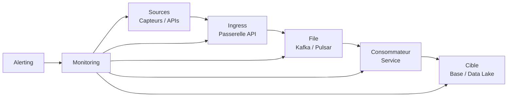
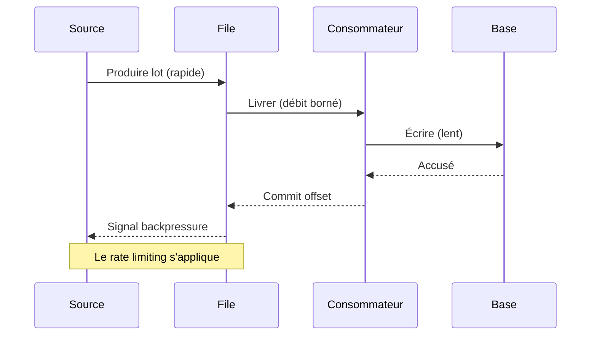
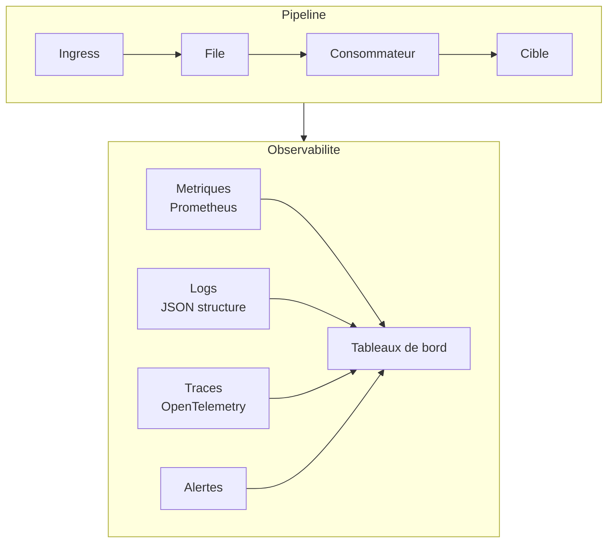
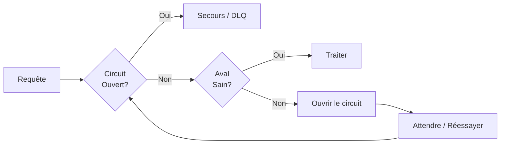

L'ingestion temps réel paraît simple sur un schéma : une source, une file, un consommateur, une base. En production, cela devient une négociation entre débit, justesse et la réalité désordonnée de systèmes amont qui tombent au pire moment.

## Le backpressure est une fonctionnalité, pas un échec

Quand l'aval ralentit, vous avez trois options : jeter, bufferiser ou bloquer. Faire comme si cela n'arrivait jamais n'en est pas une. Concevoir une stratégie de backpressure explicite — files bornées, alertes sur le retard des consommateurs, dégradation gracieuse — c'est ce qui empêche un pipeline de prendre du retard en silence.

```python
async def consume(stream, sink, max_inflight=256):
    semaphore = asyncio.Semaphore(max_inflight)
    async for batch in stream:
        async with semaphore:
            await sink.write(batch)  # concurrence bornée = backpressure naturel
```

## L'idempotence sauve votre astreinte

Une livraison "au moins une fois" signifie que les doublons ne sont pas un peut-être, mais un quand. Chaque chemin d'écriture doit être idempotent — un upsert sur un identifiant stable, pas un insert aveugle. Cette seule décision transforme une catégorie d'incidents de 3 h du matin en non-événement.

## Rendre les problèmes de qualité de données bruyants

La pire panne de pipeline est la silencieuse : la donnée continue de circuler, mais elle est subtilement fausse. Les dashboards semblent corrects jusqu'à ce que quelqu'un en aval remarque des chiffres qui ne collent pas.

- Valider au bord et rejeter tôt.
- Émettre des métriques sur les enregistrements rejetés, pas seulement acceptés.
- Alerter sur l'*absence* de données attendues, pas uniquement sur les erreurs.

> Un pipeline qui échoue bruyamment est un bon pipeline. Un pipeline qui ment en silence est un risque.

L'objectif n'a jamais été zéro incident — c'était une détection rapide et une reprise ennuyeuse. Construisez pour le jour où ça casse, car ça cassera.

## L'architecture canonique

Un pipeline d'ingestion temps réel déplace des données depuis des sources hétérogènes vers un système où elles peuvent être interrogées, analysées ou exploitées. La forme standard compte cinq étapes :



Chaque étape a un contrat distinct. Les sources émettent des événements. L'ingress authentifie, limite et regroupe par lots. La file assure la durabilité et l'ordre. Les consommateurs transforment et valident. La cible rend la données interrogeables. Si le contrat est rompu à une étape, l'ensemble du système en pâtit.

La latence cible à l'ingress doit être inférieure à 50 ms p99. De bout en bout — de la lecture du capteur à la ligne interrogeable — elle doit rester en dessous de 2 secondes pour 99 % des événements aux débits observés dans la télémétrie d'éoliennes (souvent 50k–200k événements par seconde par ferme).

## Partitionnement et ordonnancement

L'ordre des événements compte lorsque les consommateurs calculent des agrégats sur des fenêtres temporelles. Une lecture de température du capteur A à 12:00:01 doit précéder celle de 12:00:02. Si la file réordonne les événements, le consommateur voit une série temporelle déformée.

La solution est la clé de partition. Chaque événement porte une clé — l'identifiant de l'appareil, de la turbine — et la file garantit l'ordre à l'intérieur d'une partition. Des partitions mal adaptées causent un blocage de tête de file ; trop de partitions augmentent les surcoûts de métadonnées.



Le backpressure n'est pas un mode de défaillance — c'est le protocole par lequel la file dit à la source de ralentir. Sans lui, la mémoire croît sans limite et les pics de latence deviennent la norme.

## Observabilité dès le premier jour

On ne peut pas corriger ce que l'on ne voit pas. Un pipeline a besoin de trois signaux :

- **Métriques** — débit, retard, taux d'erreur, latence p50/p99. Exportées vers Prometheus.
- **Logs** — JSON structuré avec des identifiants de corrélation pour tracer un événement de l'ingress à la cible.
- **Traces** — spans OpenTelemetry à travers les frontières de service pour savoir où le temps est dépensé.



Alertez sur les symptômes, pas sur les causes. "Le retard du consommateur dépasse 10 minutes" est un symptôme. "Le broker Kafka 3 est à 90 % de disque" est une cause. Alerter sur les causes vous donne plus de pages et moins de signal. Alerter sur les symptômes vous donne du contexte.

## Schémas de dégradation gracieuse

Quand l'aval est en mauvaise santé, vous avez des options au-delà de planter ou de tout jeter.

### Disjoncteurs (circuit breakers)

Un disjoncteur entoure l'appel à l'aval. Après N échecs dans une fenêtre, il s'ouvre et court-circuite les appels suivants. Le pipeline continue d'accepter des événements, les écrit dans un magasin de secours et réessaye quand le disjoncteur se ferme.



### Files de lettres mortes

Les événements qui ne peuvent pas être traités — payloads malformés, incompatibilités de schéma — vont dans une file de lettres mortes. Ils ne bloquent pas le flux principal et ne disparaissent pas. Un worker séparé ou un traitement batch quotidien réessaye ou les inspecte.

### Cibles de secours

Si la base primaire est en panne, écrivez dans le stockage objet. Si le cache est en panne, servez depuis la base. Les données peuvent être obsolètes, mais le système continue de fonctionner. C'est l'état d'esprit "embrasser l'échec" : supposez que les composants tombent en panne et concevez le chemin de données pour qu'il survive.

## Évolution des schémas

Les schémas changent. Un champ est ajouté, un type est élargi, un champ est déprécié. Dans un pipeline en streaming, les changements de schéma sont risqués parce que les consommateurs peuvent exécuter du code ancien.

Les règles sont simples :

- **Ne cassez jamais la compatibilité.** Ajouter des champs est sûr. Supprimer des champs ou rétrécir des types ne l'est pas.
- **Utilisez des registres de schémas.** Confluent Schema Registry ou similaire vous permet d'appliquer des règles de compatibilité au moment de la production.
- **Versionnez explicitement.** Quand un changement cassant est inévitable, versionnez le topic (`events-v2`) et exécutez les consommateurs côte à côte.
- **Testez les consommateurs contre les nouveaux schémas avant de les déployer.** Un consommateur canary lit le nouveau topic et valide le comportement avant que la flotte ne bascule.

## Stratégies de test

Un pipeline qui fonctionne en dev mais échoue en prod n'est pas un pipeline — c'est un espoir. Testez les conditions que vous rencontrerez en production.

### Ingénierie du chaos

Injectez des défaillances à chaque étape. Tue un broker pendant que le pipeline tourne. Corromps un lot. Introduis des pics de latence. Voyez comment le système se comporte. Si vous ne pouvez pas simuler la défaillance, vous ne pouvez pas faire confiance au chemin de récupération.

### Test de charge

Faites tourner le pipeline à 2x du pic attendu pendant 30 minutes. Surveillez la mémoire, le CPU et le disque. Surveillez le retard des consommateurs. Surveillez la file. Un pipeline qui semble sain à 10k événements/s peut s'effondrer à 200k.

### Test de contrat

Chaque étape a un contrat : l'ingress attend un POST avec un jeton d'authentification, la file attend des octets, le consommateur attend un schéma spécifique. Testez que chaque contrat est honoré. Si l'ingress change son format d'authentification, le consommateur ne doit pas être le premier à s'en apercevoir.

## Schémas de déploiement

Les pipelines ne sont pas déployés une fois et oubliés. Ils évoluent. Les schémas de déploiement comptent.

### Blue/green

Exécutez deux environnements identiques. Acheminez le trafic vers green pendant que blue est mis à jour. Si green est sain, promouvez-le. Sinon, revenez à blue en quelques secondes. C'est le schéma le plus sûr pour les consommateurs avec état parce que vous pouvez vider l'ancien environnement sans perdre de données.

### Canary

Acheminez un petit pourcentage du trafic vers la nouvelle version. Surveillez les taux d'erreur et la latence. Si le canary est sain, augmentez le trafic. Sinon, revenez en arrière. C'est utile pour les consommateurs sans état qui peuvent être mis à l'échelle horizontalement.

### Rolling

Mettez à jour les instances une par une. Chaque instance est vidée, mise à jour et réintégrée. C'est le comportement par défaut pour les consommateurs conteneurisés mais nécessite une coordination prudente avec la file pour éviter le traitement en double ou les événements manqués.

## Conclusion

Un pipeline d'ingestion temps réel n'est jamais "terminé." Les sources changent, les schémas évoluent et les systèmes aval ont des jours difficiles. Les équipes qui gardent leurs pipelines en santé partagent quelques traits :

1. **Elles traitent le backpressure comme une préoccupation de premier ordre**, pas comme un bug à supprimer.
2. **Elles conçoivent pour l'idempotence dès le départ**, parce que les doublons sont inévitables.
3. **Elles instrumentent tout avant d'en avoir besoin**, parce que les incidents arrivent à 3 h du matin.
4. **Elles construisent pour la dégradation**, parce que la disponibilité parfaite est un mythe.
5. **Elles testent sous pression**, parce que le trafic normal ne révèle jamais les coutures.

L'objectif n'est pas de prévenir chaque défaillance. C'est de rendre les défaillances visibles, bornées et récupérables.
